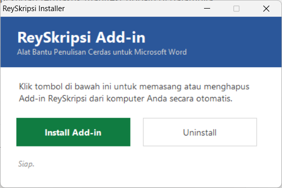
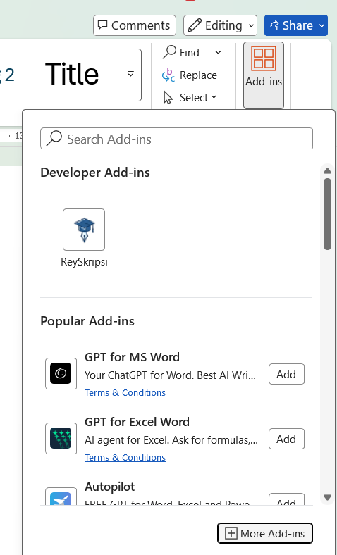
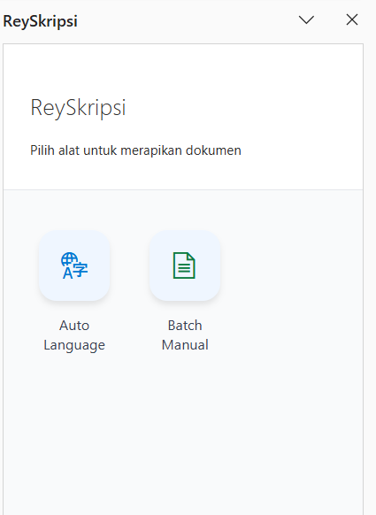
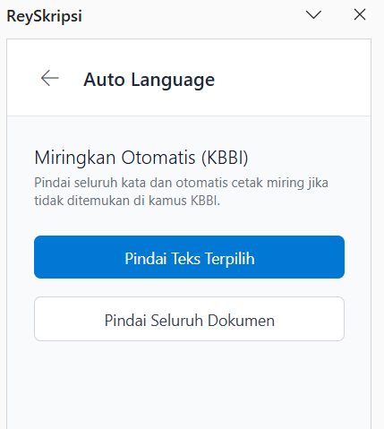
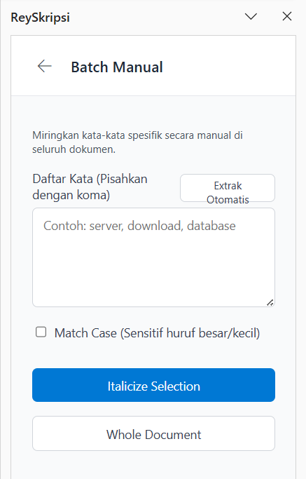
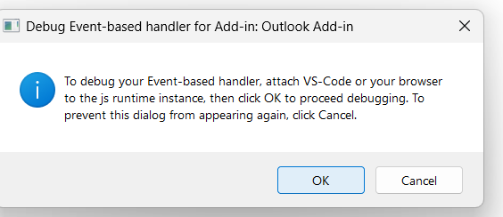

# ReySkripsi - Microsoft Word Add-in

ReySkripsi adalah Microsoft Word Add-in yang dirancang khusus untuk mempermudah proses merapikan dan memformat dokumen karya ilmiah atau skripsi. 

## 🚀 Fitur Utama
- **Deteksi Kata Asing:** Otomatis menandai atau mengubah kata asing/typo yang tidak ada di dalam Kamus Besar Bahasa Indonesia (KBBI).
- **Format Typografi:** Memperbaiki format tulisan secara instan.
- **Dukungan Penuh:** Bekerja mulus baik di Word untuk Web maupun Word Desktop (Windows/Mac).

---

## Demo Aplikasi

Berikut adalah tampilan fitur dan kemampuan ReySkripsi saat digunakan di Microsoft Word:

  
  
  
  
  

---

## 📥 Panduan Instalasi (Word Local / Desktop)

### Persyaratan
- Microsoft Word (Windows Desktop)
- Windows 10 / 11

### Instalasi Cepat via Installer (Rekomendasi)

Mulai sekarang, Anda tidak perlu lagi melakukan setup "Shared Folder" atau "Trust Center" yang rumit!

1. Unduh aplikasi `reyskripsi-manager.exe` terbaru dari [halaman GitHub Releases](https://github.com/rey-workbench/ReySkripsi/releases/latest).
2. **Klik Ganda (Double Click)** aplikasi `reyskripsi-manager.exe` tersebut.
3. Jendela Installer akan muncul. Klik tombol **Install Add-in** dan tunggu notifikasi sukses.
4. Buka aplikasi **Microsoft Word**, lalu buat dokumen kosong (Blank Document).
5. Pergi ke tab **Home** (atau Insert) > klik **Add-ins** > lalu cari menu **Developer Add-ins** (atau _My Add-ins_).
6. Klik **ReySkripsi** untuk membukanya di panel samping (Taskpane).

  

### Cara Uninstall
Buka kembali aplikasi `reyskripsi-manager.exe` lalu klik tombol **Uninstall**. Add-in akan otomatis terhapus bersih dari sistem Anda.

---

## 🌐 Panduan Instalasi (Word di Web)

1. Buka [Word di Web](https://word.office.com) dan buat dokumen kosong baru.
2. Pergi ke tab **Home** (Beranda) atau **Insert** (Sisipkan) pada pita menu.
3. Cari dan klik tombol **Add-ins**.
4. Pada dialog Office Add-ins, pilih **Upload My Add-in** (Unggah Add-in Saya).
5. Pilih file `manifest.xml` (bisa diunduh dari [GitHub](https://github.com/rey-workbench/ReySkripsi)) dan klik **Upload**.
6. Add-in akan muncul di tab Home atau sebagai panel tugas di sebelah kanan.
